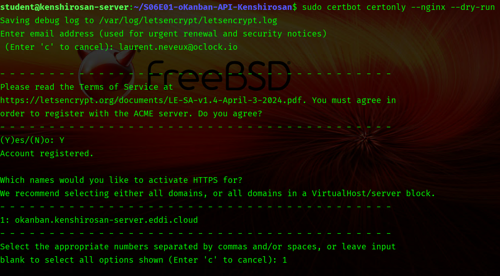
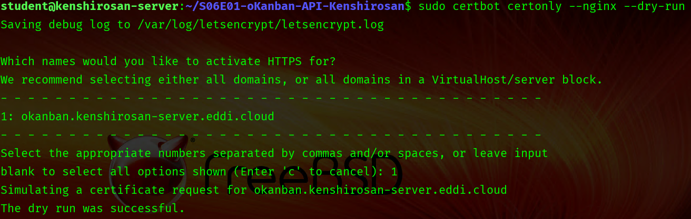
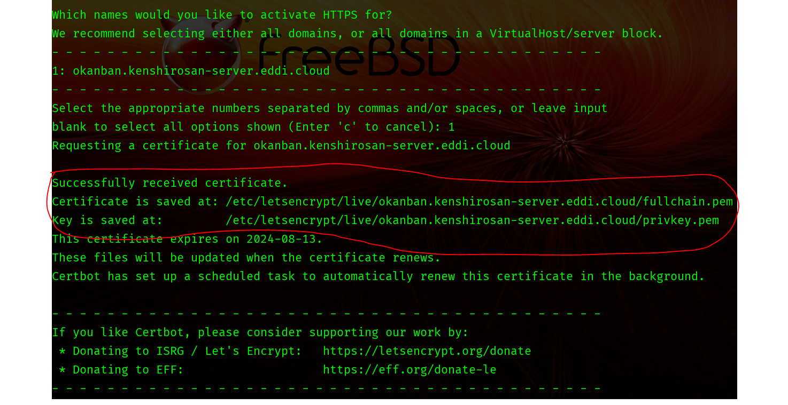
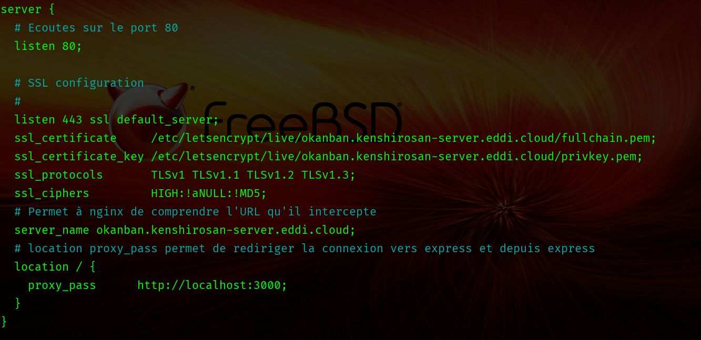
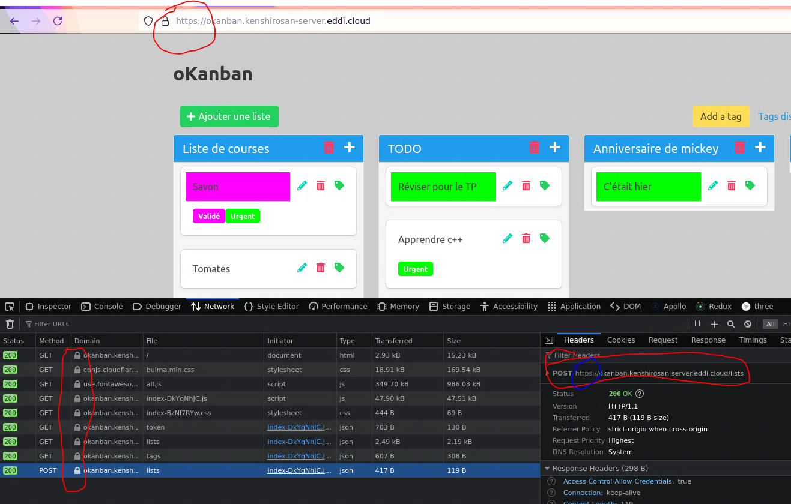

# HTTPS avec Certbot

---

On met en place un certificat `tls / ssl` pour avoir `https`.

**DISCLAIMER** tout ce qu'on fait ne sera valable que si on travaille avec `ubuntu linux`

**DISCLAIMER 2** il faut travailler sur les vm avec le nom de domaine `okanban.pseudogithub-server.eddi.cloud` ou sur votre serveur privé si vous avez un nom de domaine, dans ce cas, vous adapterez toutes les URL pour qu'elles correspondent à vos configs et nom de domaine.

**DISCLAIMER 3** si on travaille sur la vm avec nom de domaine `okanban.pseudogithub-server.eddi.cloud` il faut obligatoirement rendre sa vm publique.

## Démarrer okanban

```bash
pm2 restart okanban
```

S'assurer que tout est fonctionnel sur l'adresse `http://okanban.PSEUDOGITHUB-server.eddi.cloud`

## Installer `nginx`

```bash
# Sur les vm oclock, on l'a fait ensemble en début de S08, pas besoin de le refaire.
sudo apt update && sudo apt install nginx
# aller sur localhost et confirmer que nginx est installé, on devrait tomber sur la page d'accueil de nginx
```

## Installer et tester certbot sur la machine

La doc : <https://certbot.eff.org/instructions?ws=nginx&os=ubuntufocal>

```bash
sudo snap install --classic certbot

sudo ln -s /snap/bin/certbot /usr/bin/certbot

# générer un certificat pour nginx : tester le bon fontionnement de certbot avec un dry run
sudo certbot certonly --nginx --dry-run
```

certbot va demander une address email (vous n'aurez pas de spams) et vous demandera de choisir pour quel site vous voulez le certificat (il faut entrer un nombre, si on n'a qu'un site ce sera 1, mais il faut lire attentivement les messages dans le terminal) :

1. Mon premier dry run a échoué, ma machine n'était pas publique.

2. le second est ok.


Quand le dry run est ok, on peut passer à l'étape suivante.

## Création du certificat

```bash
sudo certbot certonly --nginx
```

Si le dry run a été fait avec succès, on reçoit un **certificat valide**



> **Se souvenir de l'emplacement des certificats, on va en avoir besoin pour configurer nginx**

## Configuration de nginx

```bash

# Certificate is saved at: /etc/letsencrypt/live/okanban.PSEUDOGITHUB-server.eddi.cloud/fullchain.pem
# Key is saved at:         /etc/letsencrypt/live/okanban.PSEUDOGITHUB-server.eddi.cloud/privkey.pem

sudo nano /etc/nginx/sites-available/okanban.conf
```

Voici le nouveau contenu de ce fichier, il s'agit d'ajouter quelques lignes, je les colle après l'image pour vous faciliter la tâche :



On n'oublie pas de changer le PSEUDOGITHUB par le votre avant de copy pasta :

```bash
server {
  # Ecoutes sur le port 80
  listen 80;
 
  # SSL configuration
  #
  listen 443 ssl default_server;
  ssl_certificate     /etc/letsencrypt/live/okanban.PSEUDOGITHUB-server.eddi.cloud/fullchain.pem;
  ssl_certificate_key /etc/letsencrypt/live/okanban.PSEUDOGITHUB-server.eddi.cloud/privkey.pem;
  ssl_protocols       TLSv1 TLSv1.1 TLSv1.2 TLSv1.3;
  ssl_ciphers         HIGH:!aNULL:!MD5;
  # Permet à nginx de comprendre l'URL qu'il intercepte
  server_name okanban.PSEUDOGITHUB-server.eddi.cloud;
  # location proxy_pass permet de rediriger la connexion vers express et depuis express
  location / {
    proxy_pass      http://localhost:3000;
  }
}
```

Quand le fichier est modifiée, on peut recharger la config de nginx :

```bash
sudo service nginx reload
```
A ce stade, on a déjà la possibilité d'aller d'aller sur `https`, mais on doit encore modifier le front pour que les appels à l'API utilisent `https` :

On ouvre le fichier `assets/js/config.module.js` et on ajoute le `s` à `http` :

```js
const config = {
    base_url: 'https://okanban.PSEUDOGITHUB-server.eddi.cloud',
};
```

On rebuild le front :

```bash
npm run build:front
```

Et c'est terminé :) 


